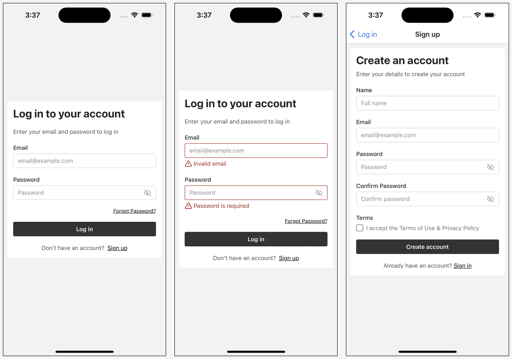

# React Native - Laravel - Starter Kit

An Expo React Native app using Laravel Sanctum token auth.

- Laravel Sanctum Token Auth
- gluestack-ui v3 for styling
- Zod schema validation
- React Hook Form
- Tanstack Query

- Auth Pages: Log in, Sign up, & Forgot Password
- Other Pages: Dashboard, Profile

## Screenshots




## Get started

1. Install dependencies

   ```bash
   npm install
   ```

2. Rename and update .env file
   - Rename .env.example to .env
   - Update .env file with your api url

3. Start the app

   ```bash
   npx expo start
   ```

## Laravel API

https://github.com/genonline/laravel-api-for-react-native-starter-kit

## Tests

```
npm run test
```
